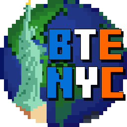
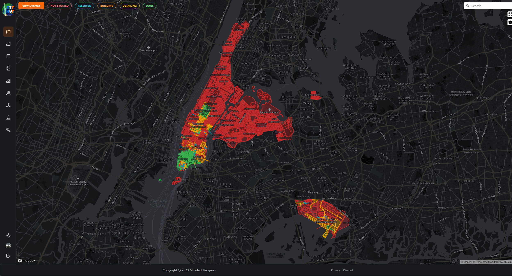

<br/>
<p align="center">
  <a href="https://github.com/MinefactProgress/frontend">
    
  </a>

  <h3 align="center">MinefactProgress/frontend</h3>

  <p align="center">
    Frontend for the MinefactProgress Website
    <br/>
    <br/>
    <a href="https://progress.minefact.de"><strong>Open the Website »</strong></a>
    <br/>
    <br/>
    <a href="https://github.com/MinefactProgress/frontend/issues">Report Bug</a>
    .
    <a href="https://github.com/MinefactProgress/frontend/issues">Request Feature</a>
    </p>
</p>

 


## About The Project



This project serves as a Website for tracking the progress made in the BuildTheEarth New York City supproject of [BuildTheEarth](https://buildtheearth.net). On it, the builders can claim their own plots and register the progess on them. Other features include:

* An Overview of total Project build by everyone on the server
* An Event System (In Progress)
* List and Map views for Districts and Blocks of Districts
* Staff Team / Builder List
* BuildTheEarth.net Minecraft Network Status
* Special Claim System for Landmarks

## Built With

This Project utilizes many different frameworks and packages from [npmjs](https://www.npmjs.com/):

- [Next.js](https://nextjs.org/)
- [Mantine](https://mantine.dev/)
- [Chart.js](https://www.chartjs.org/)
- [mapbox-gl](https://www.mapbox.com/)

## Getting Started

To get a local copy up and running follow these steps:

### Prerequisites

- nodejs with npm

We suggest you use yarn. Follow these steps to install it: [yarnpkg.com](https://yarnpkg.com/getting-started/install)

### Installation

1. Get a free API Key for mapbox at [https://mapbox.com/](https://account.mapbox.com/)

2. Clone the repo

```sh
git clone https://github.com/MinefactProgress/frontend.git
```

3. Install packages

```sh
yarn
```

4. Copy `example.env` and rename it to `.env`

5. Enter all required credentials, including the API Key from step 1

6. Run the project using `yarn dev` or `yarn serve`

## Contributing

Contributions are what make the open source community such an amazing place to be learn, inspire, and create. **Any** contributions you make are greatly appreciated.

- If you have suggestions for adding or removing projects, feel free to open an issue to discuss it, or directly create a pull request after you edit the README.md file with necessary changes.
- Please make sure you check your spelling and grammar.
- Create individual PR for each suggestion.

### Creating A Pull Request

1. Fork the Project
2. Create your Feature Branch (`git checkout -b feature/AmazingFeature`)
3. Commit your Changes (`git commit -m 'Add some AmazingFeature'`)
4. Push to the Branch (`git push origin feature/AmazingFeature`)
5. Open a Pull Request

## License

Distributed under the GNU GPL License. See [LICENSE](https://github.com/MinefactProgress/frontend/blob/main/LICENSE) for more information.

## Authors

- **Jannik0308** - ** - [Jannik0308](https://github.com//Jannik0308) - **
- **Nudelsuppe42** - ** - [Nudelsuppe42](https://github.com/Nudelsuppe42) - **

## Acknowledgements

- [BuildTheEarth](https://buildtheearth.net/)
- [BTE NYC](https://progress.minefact.de/)
- [Vercel](https://vercel.com/)
